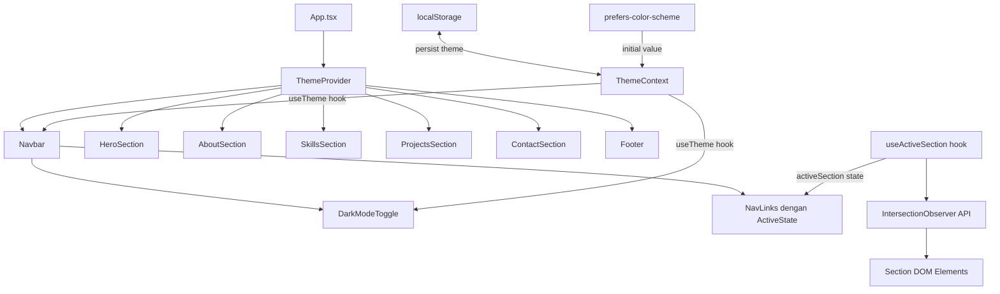
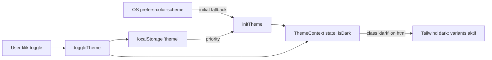
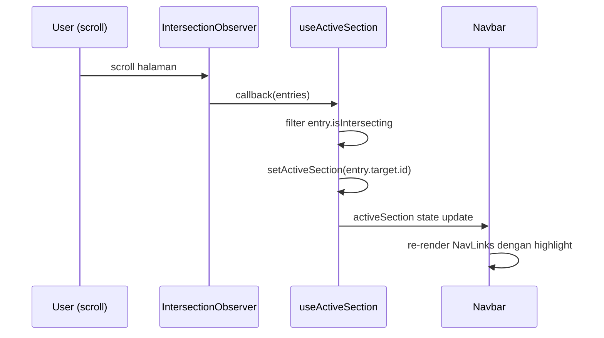

# Design Document: Dark Mode & Active Nav Indicator

## Overview

Fitur ini menambahkan dua peningkatan UI ke website portofolio yang sudah ada: (1) **Dark Mode** — toggle yang mengubah seluruh tampilan website ke tema gelap menggunakan Tailwind CSS `dark:` variant, dengan preferensi disimpan di `localStorage`; dan (2) **Active Nav Indicator** — navbar yang secara otomatis meng-highlight item navigasi yang sesuai dengan section yang sedang terlihat di viewport, menggunakan `IntersectionObserver` API.

Kedua fitur ini bersifat independen secara fungsional namun terintegrasi dalam komponen `Navbar` yang sama. State dark mode dikelola melalui React Context agar dapat diakses oleh seluruh komponen tree tanpa prop drilling.

---

## Architecture

### High-Level Architecture



### Alur Data Dark Mode



### Alur Data Active Nav



---

## Components and Interfaces

### `ThemeContext` & `ThemeProvider`

**File**: `src/context/ThemeContext.tsx`

**Purpose**: Menyediakan state dark mode secara global ke seluruh komponen tree.

**Interface**:
```typescript
interface ThemeContextValue {
  isDark: boolean;
  toggleTheme: () => void;
}

const ThemeContext = createContext<ThemeContextValue | undefined>(undefined);

function ThemeProvider({ children }: { children: React.ReactNode }): JSX.Element

function useTheme(): ThemeContextValue  // custom hook, throws jika di luar Provider
```

**Responsibilities**:
- Membaca preferensi awal dari `localStorage` atau `prefers-color-scheme` media query
- Menerapkan/menghapus class `dark` pada elemen `<html>` saat state berubah
- Menyimpan preferensi ke `localStorage` setiap kali toggle dipanggil
- Menyediakan `isDark` dan `toggleTheme` ke seluruh consumer

---

### `DarkModeToggle`

**File**: `src/components/DarkModeToggle.tsx`

**Purpose**: Tombol toggle yang menampilkan ikon matahari/bulan dan memanggil `toggleTheme`.

**Interface**:
```typescript
// Tidak menerima props — mengambil state dari useTheme()
function DarkModeToggle(): JSX.Element
```

**Responsibilities**:
- Menampilkan ikon bulan (🌙) saat light mode, ikon matahari (☀️) saat dark mode
- Memanggil `toggleTheme()` saat diklik
- Memiliki `aria-label` yang deskriptif dan berubah sesuai state

---

### `Navbar` (dimodifikasi)

**File**: `src/components/Navbar.tsx`

**Purpose**: Navbar yang sudah ada, diperluas dengan dark mode support dan active nav indicator.

**Perubahan**:
- Menggunakan `useTheme()` untuk dark mode styling
- Menggunakan `useActiveSection()` untuk menentukan link aktif
- Merender `DarkModeToggle` di sebelah hamburger button
- Menerapkan class aktif pada nav link yang sesuai

---

### `useActiveSection` Hook

**File**: `src/hooks/useActiveSection.ts`

**Purpose**: Custom hook yang menggunakan `IntersectionObserver` untuk melacak section mana yang sedang terlihat.

**Interface**:
```typescript
interface UseActiveSectionOptions {
  sectionIds: string[];
  rootMargin?: string;   // default: '-20% 0px -70% 0px'
  threshold?: number;    // default: 0
}

function useActiveSection(options: UseActiveSectionOptions): string
// returns: id section yang aktif (e.g. 'hero', 'about', 'skills', ...)
```

**Responsibilities**:
- Membuat `IntersectionObserver` yang mengamati semua section berdasarkan `sectionIds`
- Mengembalikan `id` dari section yang paling banyak terlihat di viewport
- Cleanup observer saat komponen unmount
- Menangani edge case: scroll ke atas (kembali ke 'hero'), tidak ada section yang intersect

---

## Data Models

### Theme State

```typescript
type Theme = 'light' | 'dark';

// localStorage key
const THEME_STORAGE_KEY = 'portfolio-theme';

// Initial theme resolution priority:
// 1. localStorage value (jika ada dan valid)
// 2. OS prefers-color-scheme
// 3. Fallback: 'light'
```

### Active Section State

```typescript
// Section IDs yang dilacak — harus sesuai dengan id attribute di JSX
const SECTION_IDS = ['hero', 'about', 'skills', 'projects', 'contact'] as const;
type SectionId = typeof SECTION_IDS[number];
```

---

## Low-Level Design

### ThemeContext Implementation

```typescript
// src/context/ThemeContext.tsx

function getInitialTheme(): Theme {
  // 1. Cek localStorage
  const stored = localStorage.getItem(THEME_STORAGE_KEY);
  if (stored === 'dark' || stored === 'light') return stored;

  // 2. Cek OS preference
  if (window.matchMedia('(prefers-color-scheme: dark)').matches) return 'dark';

  // 3. Default
  return 'light';
}

function ThemeProvider({ children }) {
  const [isDark, setIsDark] = useState<boolean>(() => getInitialTheme() === 'dark');

  useEffect(() => {
    const root = document.documentElement;
    if (isDark) {
      root.classList.add('dark');
    } else {
      root.classList.remove('dark');
    }
    localStorage.setItem(THEME_STORAGE_KEY, isDark ? 'dark' : 'light');
  }, [isDark]);

  const toggleTheme = useCallback(() => setIsDark(prev => !prev), []);

  return (
    <ThemeContext.Provider value={{ isDark, toggleTheme }}>
      {children}
    </ThemeContext.Provider>
  );
}
```

**Preconditions**:
- `localStorage` tersedia (browser environment)
- Elemen `<html>` dapat diakses via `document.documentElement`

**Postconditions**:
- Class `dark` ada di `<html>` jika dan hanya jika `isDark === true`
- `localStorage['portfolio-theme']` selalu sinkron dengan `isDark`

---

### useActiveSection Hook Implementation

```typescript
// src/hooks/useActiveSection.ts

function useActiveSection({
  sectionIds,
  rootMargin = '-20% 0px -70% 0px',
  threshold = 0,
}: UseActiveSectionOptions): string {
  const [activeSection, setActiveSection] = useState<string>(sectionIds[0] ?? '');

  useEffect(() => {
    const observer = new IntersectionObserver(
      (entries) => {
        // Ambil entry yang sedang intersecting
        const intersecting = entries.find(entry => entry.isIntersecting);
        if (intersecting) {
          setActiveSection(intersecting.target.id);
        }
      },
      { rootMargin, threshold }
    );

    // Observe semua section
    sectionIds.forEach(id => {
      const el = document.getElementById(id);
      if (el) observer.observe(el);
    });

    // Cleanup
    return () => observer.disconnect();
  }, [sectionIds, rootMargin, threshold]);

  return activeSection;
}
```

**Preconditions**:
- `sectionIds` adalah array non-empty dari string ID yang valid
- Elemen DOM dengan ID tersebut sudah ada saat hook dijalankan
- `IntersectionObserver` tersedia di browser

**Postconditions**:
- Return value selalu berupa salah satu dari `sectionIds`
- Observer di-disconnect saat komponen unmount (no memory leak)

**Loop Invariants**:
- Setiap `id` dalam `sectionIds` di-observe tepat satu kali
- Hanya elemen yang ditemukan di DOM yang di-observe (null-safe)

---

### Tailwind Dark Mode Strategy

**Konfigurasi** (`tailwind.config.js`):
```javascript
export default {
  content: ['./index.html', './src/**/*.{js,ts,jsx,tsx}'],
  darkMode: 'class',  // ← tambahkan ini
  theme: { extend: {} },
  plugins: [],
}
```

**Strategi class mapping** — setiap komponen menambahkan `dark:` variant:

```
Light Mode                    Dark Mode
─────────────────────────────────────────────────────
bg-white                  →  dark:bg-gray-900
bg-gray-50                →  dark:bg-gray-800
bg-indigo-50              →  dark:bg-gray-900
text-gray-900             →  dark:text-white
text-gray-700             →  dark:text-gray-300
text-gray-600             →  dark:text-gray-400
text-gray-800             →  dark:text-gray-200
border-gray-100           →  dark:border-gray-700
bg-white shadow-sm (Navbar) → dark:bg-gray-900 dark:shadow-gray-800
bg-gray-900 (Footer)      →  (sudah gelap, tidak perlu ubah)
```

**Contoh penerapan di komponen**:
```tsx
// Navbar
<header className="fixed top-0 left-0 right-0 z-50 bg-white dark:bg-gray-900 shadow-sm dark:shadow-gray-800">

// HeroSection
<section className="min-h-screen ... bg-gradient-to-br from-indigo-50 to-white dark:from-gray-900 dark:to-gray-800">
  <h1 className="text-4xl font-bold text-gray-900 dark:text-white">

// AboutSection
<section className="py-20 bg-white dark:bg-gray-900 px-4">
  <h2 className="text-3xl font-bold text-gray-900 dark:text-white">
  <p className="text-gray-600 dark:text-gray-400">
```

---

### Active Nav Indicator — Navbar Integration

```tsx
// src/components/Navbar.tsx (modifikasi)

const SECTION_IDS = ['hero', 'about', 'skills', 'projects', 'contact'];

export default function Navbar() {
  const [menuOpen, setMenuOpen] = useState(false);
  const { isDark } = useTheme();
  const activeSection = useActiveSection({ sectionIds: SECTION_IDS });

  // Class helper untuk nav link
  const getLinkClass = (href: string) => {
    const sectionId = href.replace('#', '');
    const isActive = activeSection === sectionId;
    return [
      'font-medium transition-colors',
      isActive
        ? 'text-indigo-600 dark:text-indigo-400 border-b-2 border-indigo-600 dark:border-indigo-400'
        : 'text-gray-700 dark:text-gray-300 hover:text-indigo-600 dark:hover:text-indigo-400',
    ].join(' ');
  };

  // ...render
}
```

**Active state visual**:
- Desktop: `border-b-2 border-indigo-600` (underline) + warna teks `text-indigo-600`
- Mobile: `bg-indigo-50 dark:bg-indigo-900/30 text-indigo-600 dark:text-indigo-400 rounded` (background highlight)

---

### DarkModeToggle Implementation

```tsx
// src/components/DarkModeToggle.tsx

export default function DarkModeToggle() {
  const { isDark, toggleTheme } = useTheme();

  return (
    <button
      onClick={toggleTheme}
      aria-label={isDark ? 'Aktifkan light mode' : 'Aktifkan dark mode'}
      className="p-2 rounded-lg text-gray-700 dark:text-gray-300
                 hover:bg-gray-100 dark:hover:bg-gray-800
                 focus:outline-none focus:ring-2 focus:ring-indigo-500
                 transition-colors"
    >
      {isDark ? (
        // Sun icon
        <svg xmlns="http://www.w3.org/2000/svg" className="h-5 w-5" viewBox="0 0 24 24"
             fill="none" stroke="currentColor" strokeWidth={2} aria-hidden="true">
          <circle cx="12" cy="12" r="5" />
          <path d="M12 1v2M12 21v2M4.22 4.22l1.42 1.42M18.36 18.36l1.42 1.42
                   M1 12h2M21 12h2M4.22 19.78l1.42-1.42M18.36 5.64l1.42-1.42" />
        </svg>
      ) : (
        // Moon icon
        <svg xmlns="http://www.w3.org/2000/svg" className="h-5 w-5" viewBox="0 0 24 24"
             fill="none" stroke="currentColor" strokeWidth={2} aria-hidden="true">
          <path d="M21 12.79A9 9 0 1 1 11.21 3 7 7 0 0 0 21 12.79z" />
        </svg>
      )}
    </button>
  );
}
```

---

### App.tsx Integration

```tsx
// src/App.tsx — wrap dengan ThemeProvider

import { ThemeProvider } from './context/ThemeContext';

function App() {
  return (
    <ThemeProvider>
      <header><Navbar /></header>
      <main>
        <HeroSection data={heroData} />
        {/* ... sections lainnya */}
      </main>
      <footer><Footer /></footer>
    </ThemeProvider>
  );
}
```

---

## Correctness Properties

Library yang digunakan: **fast-check**

### Property 1: Theme persistence konsisten

*For any* sequence of `toggleTheme` calls, nilai `isDark` dan nilai yang tersimpan di `localStorage['portfolio-theme']` harus selalu sinkron — `isDark === true` jika dan hanya jika `localStorage` berisi `'dark'`.

**Validates**: Requirements 2.1, 2.2, 2.5

---

### Property 2: Class `dark` pada `<html>` selalu sinkron dengan `isDark`

*For any* state `isDark`, elemen `document.documentElement` harus memiliki class `'dark'` jika dan hanya jika `isDark === true`. Tidak boleh ada state di mana keduanya tidak sinkron.

**Validates**: Requirements 2.3, 2.4

---

### Property 3: `getInitialTheme` mengembalikan nilai yang valid

*For any* kombinasi nilai `localStorage` dan `prefers-color-scheme`, fungsi `getInitialTheme` harus selalu mengembalikan salah satu dari `'light'` atau `'dark'` — tidak pernah `undefined`, `null`, atau nilai lain.

**Validates**: Requirements 1.2, 1.3, 1.4, 1.5

---

### Property 4: `useActiveSection` selalu mengembalikan ID yang valid

*For any* array `sectionIds` yang non-empty, hook `useActiveSection` harus selalu mengembalikan string yang merupakan salah satu elemen dari `sectionIds` — tidak pernah string kosong atau ID yang tidak ada dalam array.

**Validates**: Requirements 4.1, 4.2

---

### Property 5: Active nav link selalu tepat satu

*For any* nilai `activeSection`, tepat satu nav link di desktop dan tepat satu nav link di mobile harus memiliki class aktif (`border-b-2` atau background highlight) — tidak boleh nol atau lebih dari satu link aktif secara bersamaan.

**Validates**: Requirements 5.1, 5.2, 5.3

---

### Property 6: `DarkModeToggle` aria-label selalu deskriptif dan sesuai state

*For any* nilai `isDark`, `aria-label` pada tombol toggle harus berbeda antara state `true` dan `false`, dan keduanya harus berupa string non-empty yang mendeskripsikan aksi yang akan dilakukan (bukan state saat ini).

**Validates**: Requirements 3.4, 3.5, 3.6

---

## Error Handling

| Kondisi | Penanganan |
|---|---|
| `localStorage` tidak tersedia (private browsing, dll.) | `getInitialTheme` menggunakan `try/catch`, fallback ke `prefers-color-scheme` atau `'light'` |
| `IntersectionObserver` tidak tersedia (browser lama) | Feature detection: jika tidak ada, `activeSection` default ke `sectionIds[0]` |
| Section DOM element tidak ditemukan saat observe | Skip element tersebut (null check sebelum `observer.observe()`) |
| `useTheme()` dipanggil di luar `ThemeProvider` | Throw error yang deskriptif: `"useTheme must be used within ThemeProvider"` |

---

## Testing Strategy

### Unit Tests

- `ThemeContext`: test `getInitialTheme` dengan berbagai kombinasi localStorage/OS preference
- `ThemeContext`: test bahwa `toggleTheme` mengubah `isDark` dan memperbarui localStorage
- `ThemeContext`: test bahwa class `dark` ditambah/dihapus dari `<html>` dengan benar
- `DarkModeToggle`: test render ikon yang benar sesuai `isDark`
- `DarkModeToggle`: test `aria-label` berubah sesuai state
- `useActiveSection`: test dengan mock `IntersectionObserver`
- `Navbar`: test bahwa link aktif mendapat class yang benar

### Property Tests (fast-check)

| Property | Generator |
|---|---|
| P1: Theme persistence | `fc.array(fc.constant('toggle'), { minLength: 1, maxLength: 20 })` — simulate N toggles |
| P2: Class sync | `fc.boolean()` — arbitrary isDark value |
| P3: getInitialTheme valid | `fc.option(fc.constantFrom('light', 'dark', 'invalid', ''))` × `fc.boolean()` |
| P4: activeSection valid | `fc.array(fc.string({ minLength: 1 }), { minLength: 1 })` sebagai sectionIds |
| P5: Tepat satu link aktif | `fc.constantFrom('hero', 'about', 'skills', 'projects', 'contact')` |
| P6: aria-label deskriptif | `fc.boolean()` sebagai isDark |

---

## Dependencies

| Dependency | Status | Keterangan |
|---|---|---|
| React Context API | Sudah ada | Untuk ThemeProvider |
| Tailwind CSS `darkMode: 'class'` | Perlu konfigurasi | Tambah satu baris di `tailwind.config.js` |
| `IntersectionObserver` API | Browser native | Tersedia di semua modern browser |
| `localStorage` API | Browser native | Tersedia di semua modern browser |
| fast-check | Sudah ada | Untuk property tests |

Tidak ada dependency npm baru yang perlu diinstall.
