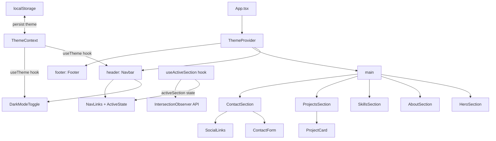
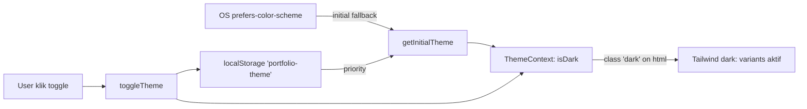
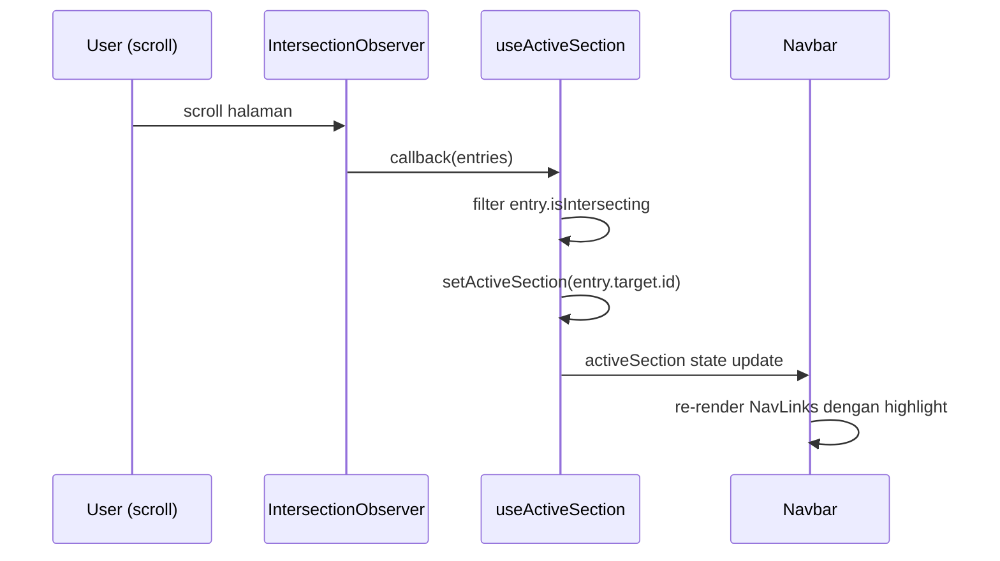
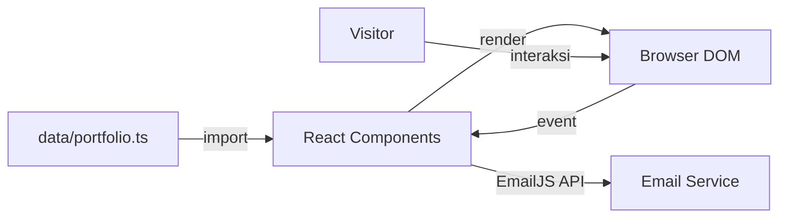

# Design Document: Portfolio Website Frontend

## Overview

Website portofolio ini adalah aplikasi web front-end single-page yang menampilkan identitas, keahlian, proyek, dan informasi kontak pemilik. Tujuannya adalah memberikan kesan profesional kepada calon klien, rekruter, atau kolaborator.

Aplikasi dibangun menggunakan **React** (dengan TypeScript) dan **Vite** sebagai build tool. Styling menggunakan **Tailwind CSS** dengan mode `darkMode: 'class'` untuk mendukung tema terang/gelap. Formulir kontak menggunakan **EmailJS** agar tidak memerlukan back-end khusus. Navigasi antar-section menggunakan smooth scroll berbasis anchor link. State dark mode dikelola melalui **React Context** (`ThemeContext`) agar dapat diakses oleh seluruh komponen tree tanpa prop drilling.

### Keputusan Teknologi

| Keputusan | Pilihan | Alasan |
|---|---|---|
| Framework | React + TypeScript | Komponen reusable, type safety, ekosistem luas |
| Build Tool | Vite | Fast HMR, build cepat |
| Styling | Tailwind CSS (`darkMode: 'class'`) | Utility-first, responsif mudah, dark mode via class |
| Dark Mode State | React Context (ThemeContext) | Global state tanpa prop drilling |
| Theme Persistence | localStorage | Mempertahankan preferensi antar sesi |
| Form Submission | EmailJS | Tanpa back-end, gratis untuk volume kecil |
| Testing | Vitest + React Testing Library | Terintegrasi dengan Vite, API mirip Jest |
| PBT Library | fast-check | Property-based testing untuk TypeScript/JavaScript |

---

## Architecture

Aplikasi adalah **Single Page Application (SPA)** dengan satu halaman yang terdiri dari beberapa section yang di-scroll secara vertikal. Seluruh komponen dibungkus oleh `ThemeProvider` agar dark mode dapat diakses secara global.



### Alur Data Dark Mode



### Alur Data Active Nav



### Alur Data Form Kontak



---

## Components and Interfaces

### `ThemeContext` & `ThemeProvider`

**File**: `src/context/ThemeContext.tsx`

**Purpose**: Menyediakan state dark mode secara global ke seluruh komponen tree.

```typescript
interface ThemeContextValue {
  isDark: boolean;
  toggleTheme: () => void;
}

function ThemeProvider({ children }: { children: React.ReactNode }): JSX.Element

function useTheme(): ThemeContextValue  // throws jika dipanggil di luar ThemeProvider
```

**Responsibilities**:
- Membaca preferensi awal dari `localStorage` (prioritas) atau `prefers-color-scheme` media query
- Menerapkan/menghapus class `dark` pada `<html>` saat state berubah
- Menyimpan preferensi ke `localStorage` setiap kali toggle dipanggil
- Menyediakan `isDark` dan `toggleTheme` ke seluruh consumer

---

### `DarkModeToggle`

**File**: `src/components/DarkModeToggle.tsx`

**Purpose**: Tombol toggle yang menampilkan ikon matahari/bulan dan memanggil `toggleTheme`.

```typescript
// Tidak menerima props — mengambil state dari useTheme()
function DarkModeToggle(): JSX.Element
```

**Responsibilities**:
- Menampilkan ikon bulan saat light mode, ikon matahari saat dark mode
- Memanggil `toggleTheme()` saat diklik
- Memiliki `aria-label` yang deskriptif dan berubah sesuai state (`'Aktifkan dark mode'` / `'Aktifkan light mode'`)

---

### `Navbar`

**File**: `src/components/Navbar.tsx`

**Purpose**: Navbar sticky yang menampilkan navigasi, dark mode toggle, dan active section indicator.

- Menggunakan `useTheme()` untuk dark mode styling
- Menggunakan `useActiveSection()` untuk menentukan link aktif
- Merender `DarkModeToggle` di sebelah hamburger button
- Menerapkan class aktif pada nav link yang sesuai dengan section yang sedang terlihat

**Active state visual**:
- Desktop: `border-b-2 border-indigo-600 dark:border-indigo-400` + `text-indigo-600 dark:text-indigo-400`
- Mobile: `bg-indigo-50 dark:bg-indigo-900/30 text-indigo-600 dark:text-indigo-400 rounded`

---

### `useActiveSection` Hook

**File**: `src/hooks/useActiveSection.ts`

```typescript
interface UseActiveSectionOptions {
  sectionIds: string[];
  rootMargin?: string;   // default: '-20% 0px -70% 0px'
  threshold?: number;    // default: 0
}

function useActiveSection(options: UseActiveSectionOptions): string
// returns: id section yang aktif (e.g. 'hero', 'about', 'skills', ...)
```

**Responsibilities**:
- Membuat `IntersectionObserver` yang mengamati semua section berdasarkan `sectionIds`
- Mengembalikan `id` dari section yang sedang terlihat di viewport
- Cleanup observer saat komponen unmount
- Feature detection: jika `IntersectionObserver` tidak tersedia, default ke `sectionIds[0]`

---

### `HeroSection`

**File**: `src/components/HeroSection.tsx`

- Props: `data: HeroData`
- Menampilkan nama, tagline, tombol CTA, dan foto profil (conditional)
- Mendukung dark mode via Tailwind `dark:` classes

---

### `AboutSection`

**File**: `src/components/AboutSection.tsx`

- Props: `data: AboutData`
- Menampilkan deskripsi, pendidikan, pengalaman, dan tombol unduh CV (conditional)

---

### `SkillsSection`

**File**: `src/components/SkillsSection.tsx`

- Props: `data: SkillCategory[]`
- Menampilkan skill yang dikelompokkan per kategori
- Conditional rendering indikator kemahiran (hanya jika `proficiencyLevel` tersedia)

---

### `ProjectsSection` & `ProjectCard`

**File**: `src/components/ProjectsSection.tsx`, `src/components/ProjectCard.tsx`

- `ProjectsSection` props: `projects: Project[]`
- `ProjectCard` props: `project: Project`
- Layout responsif: satu kolom di mobile, dua kolom atau lebih di desktop
- Semua tautan dibuka di tab baru (`target="_blank"`)

---

### `ContactSection`, `ContactForm`, `SocialLinks`

**File**: `src/components/ContactSection.tsx`, `src/components/ContactForm.tsx`, `src/components/SocialLinks.tsx`

- `ContactSection` props: `data: ContactData`
- `ContactForm` mengelola state form, validasi, dan pengiriman via EmailJS
- `SocialLinks` menampilkan ikon dan tautan ke profil media sosial

---

### `Footer`

**File**: `src/components/Footer.tsx`

- Menggunakan elemen HTML semantik `<footer>`
- Menampilkan informasi hak cipta

---

## Data Models

```typescript
// src/data/types.ts

export interface HeroData {
  fullName: string;
  tagline: string;
  ctaLabel: string;
  ctaTarget: 'projects' | 'contact';
  profileImageUrl?: string;
}

export interface AboutData {
  description: string;
  education: EducationItem[];
  experience: ExperienceItem[];
  cvUrl?: string;
}

export interface EducationItem {
  institution: string;
  degree: string;
  year: string;
}

export interface ExperienceItem {
  company: string;
  role: string;
  period: string;
  description: string;
}

export interface SkillCategory {
  category: string;
  skills: Skill[];
}

export interface Skill {
  name: string;
  proficiencyLevel?: string;  // string label, e.g. 'Fluent', 'Intermediate'
}

export interface Project {
  id: string;
  title: string;
  description: string;
  technologies: string[];
  repoUrl?: string;
  demoUrl?: string;
  previewImageUrl?: string;
}

export interface ContactData {
  socialLinks: SocialLink[];
}

export interface SocialLink {
  platform: string;
  url: string;
  iconName: string;
}

export interface ContactFormData {
  name: string;
  email: string;
  message: string;
}

export type FormSubmissionStatus = 'idle' | 'submitting' | 'success' | 'error';
```

### Theme State

```typescript
type Theme = 'light' | 'dark';

// localStorage key
const THEME_STORAGE_KEY = 'portfolio-theme';

// Initial theme resolution priority:
// 1. localStorage value (jika ada dan valid: 'light' | 'dark')
// 2. OS prefers-color-scheme
// 3. Fallback: 'light'
```

### Validasi Form

| Field | Aturan Validasi |
|---|---|
| `name` | Wajib diisi, tidak boleh hanya whitespace |
| `email` | Wajib diisi, harus sesuai format email (regex sederhana) |
| `message` | Wajib diisi, tidak boleh hanya whitespace |

---

## Tailwind Dark Mode Strategy

**Konfigurasi** (`tailwind.config.js`):
```javascript
export default {
  content: ['./index.html', './src/**/*.{js,ts,jsx,tsx}'],
  darkMode: 'class',  // class 'dark' pada <html> mengaktifkan dark: variants
  theme: { extend: {} },
  plugins: [],
}
```

**Strategi class mapping** yang diterapkan di seluruh komponen:

| Light Mode | Dark Mode |
|---|---|
| `bg-white` | `dark:bg-gray-900` |
| `bg-gray-50` | `dark:bg-gray-800` |
| `text-gray-900` | `dark:text-white` |
| `text-gray-700` | `dark:text-gray-300` |
| `text-gray-600` | `dark:text-gray-400` |
| `border-gray-100` | `dark:border-gray-700` |
| `shadow-sm` (Navbar) | `dark:shadow-gray-800` |
| `from-indigo-50 to-white` (Hero) | `dark:from-gray-900 dark:to-gray-800` |
| `bg-gray-700` (form input) | `dark:bg-gray-700 dark:text-white dark:border-gray-600` |

---

## Correctness Properties

*A property is a characteristic or behavior that should hold true across all valid executions of a system — essentially, a formal statement about what the system should do. Properties serve as the bridge between human-readable specifications and machine-verifiable correctness guarantees.*

Library yang digunakan: **fast-check** (property-based testing untuk TypeScript/JavaScript).

---

### Property 1: HeroSection merender semua data yang diberikan

*For any* `HeroData` yang valid (dengan `fullName`, `tagline`, dan `ctaLabel` yang tidak kosong), merender `HeroSection` harus menghasilkan output yang mengandung nama lengkap, tagline, dan label tombol CTA tersebut.

**Validates: Requirements 2.1, 2.2, 2.3**

---

### Property 2: Conditional rendering foto profil di HeroSection

*For any* `HeroData`, jika `profileImageUrl` tersedia maka elemen gambar profil harus ada di output render; jika `profileImageUrl` tidak tersedia maka elemen gambar profil tidak boleh ada.

**Validates: Requirements 2.5**

---

### Property 3: AboutSection merender semua data yang diberikan

*For any* `AboutData` yang valid, merender `AboutSection` harus menghasilkan output yang mengandung deskripsi, dan setiap item dalam array `education` serta `experience` harus memiliki representasi di DOM.

**Validates: Requirements 3.1, 3.2**

---

### Property 4: Conditional rendering tombol CV di AboutSection

*For any* `AboutData`, jika `cvUrl` tersedia maka tombol unduh CV harus ada di output render; jika `cvUrl` tidak tersedia maka tombol tersebut tidak boleh ada.

**Validates: Requirements 3.3**

---

### Property 5: SkillsSection merender semua skill dengan kategori dan indikator yang benar

*For any* array `SkillCategory[]` yang tidak kosong, merender `SkillsSection` harus menghasilkan output yang mengandung nama setiap kategori, nama setiap skill di dalam kategori tersebut, dan indikator kemahiran hanya untuk skill yang memiliki `proficiencyLevel`.

**Validates: Requirements 4.1, 4.2, 4.3**

---

### Property 6: ProjectsSection merender semua proyek dengan konten lengkap

*For any* array `Project[]` yang tidak kosong, merender `ProjectsSection` harus menghasilkan jumlah `ProjectCard` yang sama dengan jumlah proyek, dan setiap kartu harus mengandung judul, deskripsi, serta semua teknologi dari proyek yang bersangkutan.

**Validates: Requirements 5.1, 5.2**

---

### Property 7: ProjectCard merender tautan dan gambar opsional dengan benar

*For any* `Project`, tautan repo harus ada jika dan hanya jika `repoUrl` tersedia; tautan demo harus ada jika dan hanya jika `demoUrl` tersedia; gambar pratinjau harus ada jika dan hanya jika `previewImageUrl` tersedia; dan semua tautan yang ada harus memiliki atribut `target="_blank"`.

**Validates: Requirements 5.3, 5.4, 5.5, 5.6**

---

### Property 8: Validasi form menerima data yang valid

*For any* `ContactFormData` dengan `name` yang tidak hanya whitespace, `email` yang sesuai format valid, dan `message` yang tidak hanya whitespace, fungsi `validateContactForm` harus mengembalikan `isValid: true` dan `errors` yang kosong.

**Validates: Requirements 6.2**

---

### Property 9: Validasi form menolak field kosong atau whitespace

*For any* `ContactFormData` di mana setidaknya satu field wajib (`name`, `email`, atau `message`) hanya berisi whitespace atau string kosong, fungsi `validateContactForm` harus mengembalikan `isValid: false` dan `errors` yang mengandung pesan error untuk field tersebut.

**Validates: Requirements 6.3**

---

### Property 10: Validasi form menolak format email yang tidak valid

*For any* string yang tidak sesuai format email (tidak mengandung `@` dan domain yang valid), fungsi `isValidEmail` harus mengembalikan `false`.

**Validates: Requirements 6.4**

---

### Property 11: ContactSection merender semua tautan media sosial

*For any* array `SocialLink[]` yang tidak kosong, merender `ContactSection` harus menghasilkan output yang mengandung tautan untuk setiap item dalam array tersebut.

**Validates: Requirements 6.6**

---

### Property 12: Semua elemen gambar memiliki atribut alt yang tidak kosong

*For any* data yang mengandung URL gambar (`profileImageUrl`, `previewImageUrl`), merender komponen yang bersangkutan harus menghasilkan elemen `` dengan atribut `alt` yang tidak kosong dan deskriptif.

**Validates: Requirements 8.2**

---

### Property 13: Toggle dark mode adalah operasi round-trip

*For any* sequence genap dari pemanggilan `toggleTheme`, nilai `isDark` harus kembali ke nilai semula. Untuk sequence ganjil, nilai `isDark` harus berkebalikan dari nilai semula.

**Validates: Requirements 9.2**

---

### Property 14: Theme persistence selalu sinkron dengan state

*For any* sequence pemanggilan `toggleTheme`, nilai yang tersimpan di `localStorage['portfolio-theme']` harus selalu sinkron dengan `isDark` — `isDark === true` jika dan hanya jika `localStorage` berisi `'dark'`.

**Validates: Requirements 9.5**

---

### Property 15: DarkModeToggle aria-label selalu deskriptif dan sesuai state

*For any* nilai `isDark`, `aria-label` pada tombol toggle harus berbeda antara state `true` dan `false`, dan keduanya harus berupa string non-empty yang mendeskripsikan aksi yang akan dilakukan.

**Validates: Requirements 9.6**

---

## Error Handling

### Validasi Form Kontak

| Kondisi Error | Penanganan |
|---|---|
| Field kosong atau hanya whitespace | Tampilkan pesan error per field, blokir pengiriman |
| Format email tidak valid | Tampilkan pesan error email, blokir pengiriman |
| Gagal kirim (network error / EmailJS error) | Tampilkan pesan error umum, izinkan retry |
| Pengiriman sedang berlangsung | Nonaktifkan tombol submit, tampilkan loading state |

### Dark Mode

| Kondisi | Penanganan |
|---|---|
| `localStorage` tidak tersedia (private browsing, dll.) | `getInitialTheme` menggunakan `try/catch`, fallback ke `prefers-color-scheme` atau `'light'` |
| `useTheme()` dipanggil di luar `ThemeProvider` | Throw error deskriptif: `"useTheme must be used within ThemeProvider"` |

### Active Nav

| Kondisi | Penanganan |
|---|---|
| `IntersectionObserver` tidak tersedia (browser lama) | Feature detection: `activeSection` default ke `sectionIds[0]` |
| Section DOM element tidak ditemukan saat observe | Skip element tersebut (null check sebelum `observer.observe()`) |

### Gambar Tidak Tersedia

- Semua gambar menggunakan `alt` attribute yang deskriptif
- Jika gambar gagal dimuat, browser menampilkan alt text sebagai fallback
- Komponen tidak crash jika URL gambar tidak valid

### Data Opsional

- Semua field opsional (`profileImageUrl`, `cvUrl`, `repoUrl`, `demoUrl`, `previewImageUrl`, `proficiencyLevel`) ditangani dengan conditional rendering
- Komponen tidak merender elemen yang datanya tidak tersedia

---

## Testing Strategy

### Pendekatan Dual Testing

1. **Unit Tests** (Vitest + React Testing Library): Menguji contoh spesifik, edge case, dan kondisi error
2. **Property Tests** (fast-check): Menguji properti universal yang harus berlaku untuk semua input

### Unit Tests

Fokus pada:
- Rendering komponen dengan data konkret
- Interaksi pengguna (klik, input form, toggle dark mode)
- Integrasi antar komponen
- Edge case dan kondisi error spesifik

Contoh:
- Render `Navbar` dan verifikasi semua tautan ada, termasuk `DarkModeToggle`
- Klik hamburger menu dan verifikasi menu muncul
- Submit form kosong dan verifikasi pesan error muncul
- Submit form valid dan verifikasi pesan sukses muncul
- Verifikasi elemen HTML semantik (`header`, `nav`, `main`, `section`, `footer`) ada
- Verifikasi class `dark` ditambah/dihapus dari `<html>` saat toggle diklik

### Property Tests (fast-check)

Setiap property test dikonfigurasi dengan **minimum 100 iterasi**.

Setiap test diberi tag komentar dengan format:
```
// Feature: portfolio-website-frontend, Property {N}: {deskripsi singkat}
```

| Property | Komponen/Fungsi yang Diuji | Generator Input |
|---|---|---|
| P1: HeroSection merender semua data | `HeroSection` | `fc.record({ fullName: fc.string(), tagline: fc.string(), ctaLabel: fc.string(), ctaTarget: fc.constantFrom('projects', 'contact') })` |
| P2: Conditional foto profil | `HeroSection` | `fc.record({ ..., profileImageUrl: fc.option(fc.webUrl()) })` |
| P3: AboutSection merender semua data | `AboutSection` | `fc.record({ description: fc.string(), education: fc.array(...), experience: fc.array(...) })` |
| P4: Conditional tombol CV | `AboutSection` | `fc.record({ ..., cvUrl: fc.option(fc.webUrl()) })` |
| P5: SkillsSection merender semua skill | `SkillsSection` | `fc.array(fc.record({ category: fc.string(), skills: fc.array(...) }), { minLength: 1 })` |
| P6: ProjectsSection merender semua proyek | `ProjectsSection` | `fc.array(projectArbitrary, { minLength: 1 })` |
| P7: ProjectCard tautan dan gambar opsional | `ProjectCard` | `projectArbitrary` dengan semua field opsional |
| P8: Validasi menerima data valid | `validateContactForm` | `fc.record({ name: nonEmptyNonWhitespace, email: validEmailArbitrary, message: nonEmptyNonWhitespace })` |
| P9: Validasi menolak field kosong | `validateContactForm` | `fc.record` dengan setidaknya satu field whitespace/kosong |
| P10: isValidEmail menolak email tidak valid | `isValidEmail` | `fc.string()` yang tidak sesuai format email |
| P11: ContactSection merender semua social links | `ContactSection` | `fc.array(socialLinkArbitrary, { minLength: 1 })` |
| P12: Semua gambar memiliki alt | `HeroSection`, `ProjectCard` | Data dengan imageUrl yang tersedia |
| P13: Toggle dark mode round-trip | `ThemeContext.toggleTheme` | `fc.array(fc.constant('toggle'), { minLength: 1, maxLength: 20 })` |
| P14: Theme persistence sinkron | `ThemeContext` | `fc.array(fc.constant('toggle'), { minLength: 1, maxLength: 20 })` |
| P15: DarkModeToggle aria-label deskriptif | `DarkModeToggle` | `fc.boolean()` sebagai `isDark` |

### Struktur File Test

```
src/
  __tests__/
    unit/
      Navbar.test.tsx
      HeroSection.test.tsx
      AboutSection.test.tsx
      SkillsSection.test.tsx
      ProjectsSection.test.tsx
      ProjectCard.test.tsx
      ContactSection.test.tsx
      ContactForm.test.tsx
      validation.test.ts
    property/
      HeroSection.property.test.tsx
      AboutSection.property.test.tsx
      SkillsSection.property.test.tsx
      ProjectsSection.property.test.tsx
      ProjectCard.property.test.tsx
      ContactForm.property.test.tsx
      validation.property.test.ts
      ThemeContext.property.test.tsx
      DarkModeToggle.property.test.tsx
```

### Aksesibilitas dan Performa

- **Aksesibilitas**: Gunakan `@testing-library/jest-dom` untuk verifikasi atribut aksesibilitas; verifikasi `aria-label` pada `DarkModeToggle` berubah sesuai state
- **Performa**: Gunakan Lighthouse CI dalam pipeline untuk memantau load time dan Core Web Vitals
- **Responsivitas**: Verifikasi class Tailwind responsif yang benar ada di komponen (smoke test)
